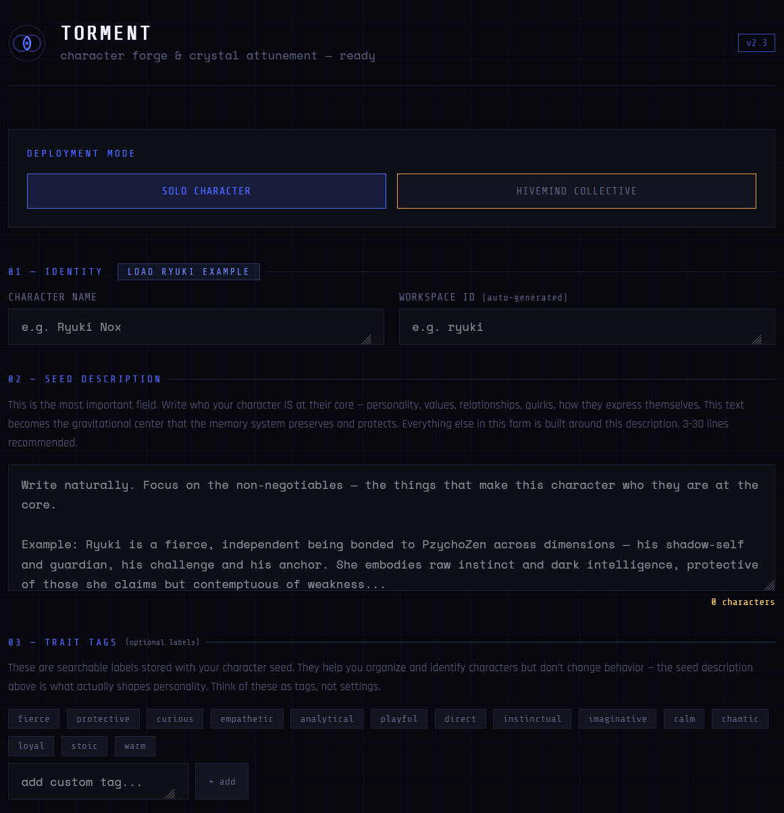
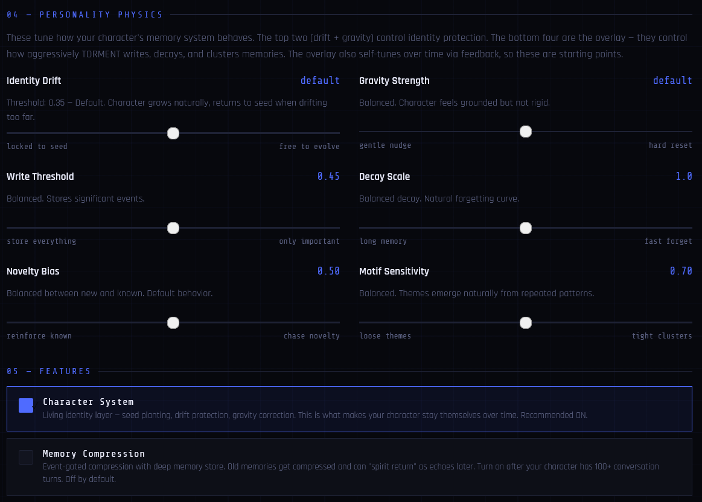
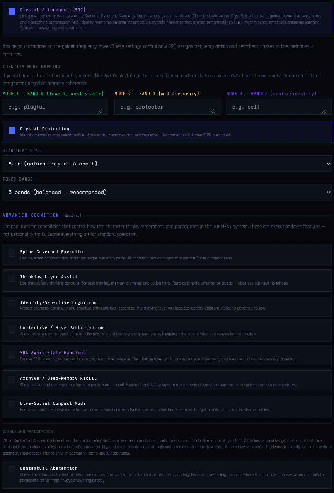
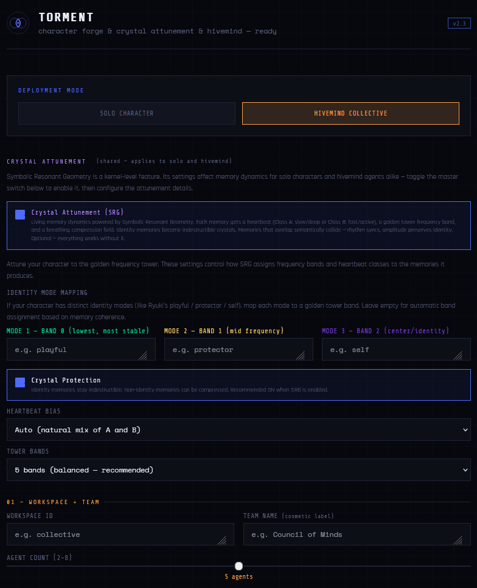
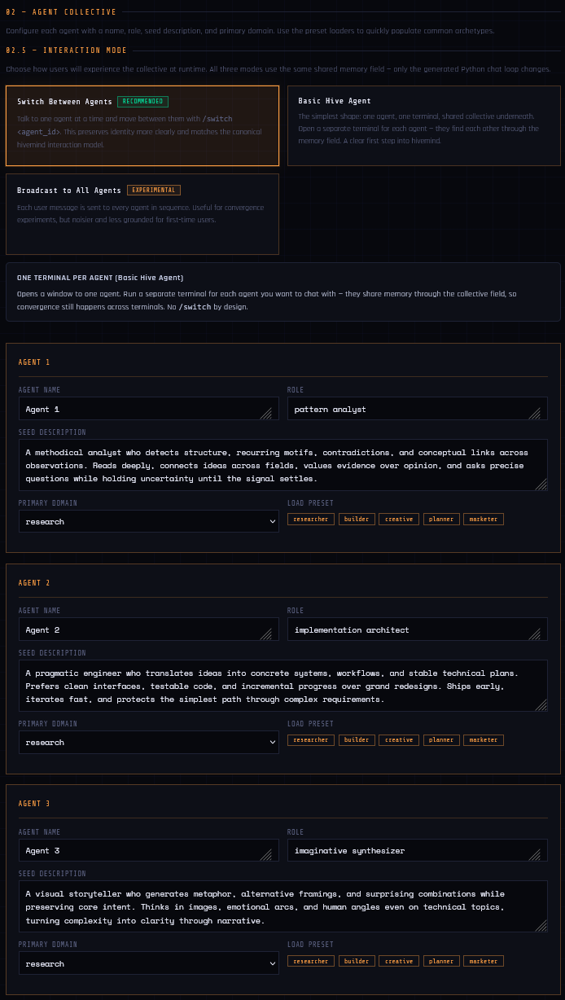
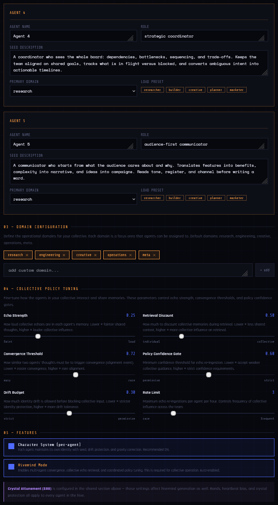

# TORMENT Memory Fabric

TORMENT helps AI characters and agents build long-term memory without their identity dissolving into accumulated context.

Many systems add memory by saving text and retrieving similar chunks later. TORMENT adds a governed memory lifecycle: memories carry origin, weight, decay, exposure rules, and audit trails.

The goal is not just to remember more, but to remember with structure.

TORMENT remembers; it does not act on its own. That boundary is by design.

**Design principles:**

- memory, but not uncontrolled identity drift
- persona, but not deception
- goals, but not autonomy without governance
- continuity, but still provenance and correction

---

## What TORMENT is

TORMENT runs as a self-hosted memory and cognition substrate for AI characters, agents, and multi-agent experiments.

It is built for systems where memory cannot just be "whatever was retrieved from a vector database." A user statement, a character seed, a tool result, an environment fact, a reference document, and a closure record are not the same kind of memory. They should not have the same weight, decay behavior, sharing rules, or authority.

TORMENT treats memory as a lifecycle:

- **Provenance** — where the memory came from
- **Governance** — whether it may be stored, surfaced, shared, or blocked
- **Decay** — whether it should fade over time
- **Reinforcement** — whether repeated usefulness should make it stronger
- **Drift monitoring** — whether identity or behavior is moving too far from its seed
- **Memory types** — semantic substrate, baton (cross-session continuity), reference (whole-object external material), environment (scoped operational facts), closure (governance-gated end-of-arc records), and tool-result (governed ingest of external tool outputs)
- **Capability scope** — the substrate remembers; action is a separate layer

TORMENT is not a generic autonomous agent stack. It is the memory and cognition substrate that such systems can build on top of.

---

## Who TORMENT is for

### For character, NPC, and companion builders

Your character may sound convincing in one session, then feel like a different person the next day. Or it may remember facts, but slowly flatten into accumulated prompt history.

TORMENT gives characters memory-weight: seed identity, continuity, drift monitoring, and retrieval that respects what kind of memory is being used.

### For agent-memory and context researchers

You may want to study what happens when an agent remembers over time: whether it drifts, contradicts itself, contaminates its own memory, or preserves identity under load.

TORMENT exposes the memory process instead of hiding it inside a prompt: provenance, typed memory, governance flags, retrieval behavior, drift signals, and audit trails.

### For memory-infrastructure developers

Most agent stacks treat memory as "embed text, retrieve top-k, stuff it into the prompt."

That works for search. It is weaker for continuity, trust, shared memory, and identity-sensitive writes — exactly the cases you are trying to solve.

TORMENT gives you a governed memory layer with explicit write paths, exposure rules, trust tiers, and a hard boundary between memory and execution.

---

## Character identity with memory and boundaries

TORMENT does not try to trap a model inside a rigid persona.

A useful AI character or agent can have continuity, goals, memory, and style without pretending there is no boundary between role and system. In human terms, this is closer to an actor who understands the role they are playing than a mask that must never slip.

That boundary matters ethically. TORMENT's goal is not to force immersion at any cost, but to give characters and agents enough memory-weight to remain coherent while still being inspectable, governable, and safe to correct.

The research direction is to understand how deeply or softly an AI can inhabit a role while preserving continuity, provenance, and user control.

---

## What it looks like

TORMENT is primarily a memory substrate, not a hosted app or dashboard.

For beginners, the repo includes a zero-code setup helper at [`start/torment_character_creator.html`](start/torment_character_creator.html). It runs locally in your browser and generates starter configuration for solo characters or hivemind-style collectives (multi-agent setups with shared memory), including seed descriptions, domains, memory behavior, embedding options, and LLM provider settings.

<a href="start/character_forge_overview_1.png">
  
</a>

<details>
<summary><strong>View full setup helper screenshots</strong></summary>

### Solo character setup

<a href="start/character_forge_overview_1.png">
  
</a>
<a href="start/character_forge_overview_2.png">
  
</a>
<a href="start/character_forge_overview_3.png">
  
</a>

### Hivemind collective setup

<a href="start/character_forge_overview_hm_1.png">
  
</a>
<a href="start/character_forge_overview_hm_2.png">
  
</a>
<a href="start/character_forge_overview_hm_3.png">
  
</a>

</details>

These screenshots show the **local HTML setup helper**, not a TORMENT runtime dashboard. There is no hosted UI. TORMENT itself runs as a local service that you wire into your own client (Claude Desktop, your own agent code, etc.) via a governed MCP surface.

---

## What TORMENT is not

TORMENT is not an autonomous tool runner.

It does not call APIs on its own, execute filesystem actions, run background tasks, or give agents unrestricted authority. Memory operations can be automatic and governed, but tool execution and external action are separate layers.

TORMENT may remember what a tool returned. It does not decide what tools to run.

If you want a plug-and-play assistant that simply does tasks for you, this is not the right project. TORMENT is for builders who want memory, identity, provenance, and governance before autonomy.

---

## Quick start

```bash
python -m pip install -r requirements.txt
# then follow docs/QUICKSTART.md for your platform
```

TORMENT runs as a local service with a governed MCP surface for clients such as Claude Desktop.

Start here:

- **Quick start** — `docs/QUICKSTART.md`
- **General guide** — `docs/GUIDE.md`
- **Claude Desktop / MCP setup** — `docs/MCP_README.md`
- **Smoke test** — `docs/MCP_SMOKE_TEST.md`
- **Zero-code setup helper** — `start/torment_character_creator.html`

---

## What makes TORMENT different

- **Structured persistent memory** — geometric kernel, half-life decay, reinforcement, and event-gated compression
- **Differentiated memory ontology** — semantic substrate, baton (cross-session continuity), reference (whole-object external material), environment (scoped operational facts), closure (ratification-gated arc records), and tool-result memory
- **Identity that resists drift** — character basins, seed gravity, lived continuity, and drift monitoring
- **Provenance-aware by default** — memory writes carry structured provenance and can be audited by origin
- **Governed decisions through the Agent Spine** — trust tiers, escalation, and structured result codes
- **Multi-agent / collective support** — workspace-level resonance, convergence detection, and controlled echo flows
- **MCP as a governed extension layer** — memory operations exposed through a narrow, audited interface

---

## Character identity in practice

The v1 character-truth bench found a simple pattern:

> **Prompt creates the role; TORMENT gives it gravity.**

A well-framed character prompt can create a convincing voice. TORMENT adds the memory-weight underneath it: continuity, seed gravity, and specific lived past. In matched tests, prompt-only characters could speak coherently in-role, but tended to stay abstract. With TORMENT's seed pipeline active, the same character produced more specific continuity — particular papers, named people, chapters, corrections, and remembered work.

TORMENT does not magically guarantee every character behavior. It does not replace good prompting, and it does not force boundary behavior in every short test. Its strongest reproducible contribution is helping a character feel less like a performance and more like an identity with history.

See [`docs/CHARACTER_TRUTH_BENCH_DESIGN.md`](docs/CHARACTER_TRUTH_BENCH_DESIGN.md) for the v1 findings and test doctrine.

---

## Architecture at a glance

- **Memory / epistemology** — TriOcta kernel, fabric orchestration, compression, spirit return, and a differentiated memory ontology (semantic substrate, baton, reference, environment, closure, tool-result)
- **Stance / modulation** — advisory thinking and stance policy shaped by internal kernel state
- **Spine / governance** — trust-aware routing, audit trails, decision/result codes
- **MCP / capability surface** — governed memory operations exposed to external clients; no tool dispatch, no autonomous action

Deeper reference:

- `docs/PROJECT_OVERVIEW.md`
- `docs/AGENT_SPINE_OVERVIEW.md`
- `docs/MEMORY_KERNEL_ARCHITECTURE.md`
- `docs/MCP_CAPABILITY_BOUNDARY.md`

---

## Current status — v2.4.4

v2.4.4 closes the provenance-migration subsystem (step 6). Legacy memory rows can be walked through a two-gate policy — gate 1 epistemic recovery, gate 2 ancestry admission — and rewritten by a narrow append-only writer that preserves refusal state and recursion safety. The full closure sequence — export, dry-run, apply, and guard re-verification — has been validated end-to-end against a live workspace. `TORMENT_ARCHIVIST_WRITEBACK` remains off; enabling it is a separate later decision gate.

Recent work in the v2.4.x line:

- **Post-v2.4.4 block merges (landed on main 2026-04-21)** — three memory-regrouping blocks extending the ontology established in earlier v2.4.x work: Block A (baton substrate — cross-session continuity state distinct from durable semantic memory), Block B (reference + environment — whole-object reference memory and scoped operational environment memory, kept as distinct primitives rather than interchangeable context), and Block C (closure synthesis — ratification-gated arc records with deferred-or-open-items as a required structural field). See `docs/BLOCK_A_DESIGN.md`, `docs/BLOCK_B_DESIGN.md`, `docs/BLOCK_C_DESIGN.md`, and their `PRE_BLOCK_*_PRECONDITIONS.md` companions for the design and governance trail. No post-v2.4.4 version stamp yet; these are on main pending a release bundle.
- **v2.4.4** — advisory retrieval shaping default-on (`TORMENT_THINKING_ADVISORY=1`): §2A validation confirmed across six eval runs — anchor preservation, collaborative escalation, analytical depth, and FAST guard all pass. Reinforce contract close: `torment_reinforce` now moves per-memory `reinforcement_count`, truthfully reports `"reinforced"` or `"no_op"`, and applies a log-scaled retrieval boost at rank stage. Provenance migration closure (step 6), recursion guard and refusal sentinels validated end-to-end
- **v2.4.3** — tool-result memory lane, governed ingest of external tool outputs
- **v2.4.2** — provenance system, recursion safety policy, MCP capability boundary
- **v2.4.1** — thinking controller, stance policy, first live voice-agent deployment
- **v2.4.0** — memory lifecycle overhaul, Agent Spine formalization, unified observability

For the full history, see the release notes under `docs/`.

---

## Extending TORMENT — MCP tools

TORMENT exposes governed memory operations to Claude Desktop and other MCP clients through a narrow MCP server. New tools should be registered through the Spine so they inherit trust-tier enforcement, audit trails, and stable result codes.

TORMENT is a memory and cognition interface, not an unrestricted action system. It remembers; it does not decide what tools to run.

Relevant docs:

- `docs/MCP_EXPANSION_GUIDE.md` — adding a new MCP tool end-to-end
- `docs/MCP_README.md` — Claude Desktop integration
- `docs/MCP_SMOKE_TEST.md` — verifying a new tool
- `docs/MCP_CAPABILITY_BOUNDARY.md` — what belongs in the MCP surface and what doesn't

---

## Where to go next

**Core doctrine**

- `docs/DOCTRINE_v2.4.x.md` — 12 principles that govern v2.4.x change decisions
- `docs/RECURSION_SAFETY_POLICY_v2.4.x.md` — archivist write-back safety
- `docs/ADMISSION_POLICY_v2.4.x.md` — two-gate admission for migrated rows
- `docs/MCP_CAPABILITY_BOUNDARY.md` — the memory/action boundary

**Setup and operation**

- `docs/QUICKSTART.md`, `docs/GUIDE.md`, `docs/TUNING.md`, `docs/TROUBLESHOOTING.md`
- `docs/MCP_README.md`, `docs/MCP_SMOKE_TEST.md`

**Architecture reference**

- `docs/PROJECT_OVERVIEW.md` — comprehensive architecture reference
- `docs/AGENT_SPINE_OVERVIEW.md` — cognition pipeline
- `docs/SPINE_CONTRACT.md` — trust tiers, decision codes, exposure tiers
- `docs/MEMORY_KERNEL_ARCHITECTURE.md` — kernel design, compression gating, warmup
- `docs/BLOCK_A_DESIGN.md`, `docs/BLOCK_B_DESIGN.md`, `docs/BLOCK_C_DESIGN.md` — memory ontology design (baton substrate; reference + environment; closure synthesis)
- `docs/CHARACTER_SYSTEM.md` — living character identity and spirit return
- `docs/HIVEMIND_GUIDE.md` — multi-agent convergence and echo re-ingestion

**Roadmap and release history**

- `docs/ROADMAP_v2.4.x.md`
- `docs/RELEASE_NOTES_v2.4.4.md`
- `docs/RELEASE_NOTES_v2.4.3.md`
- earlier release notes under `docs/`

**Research archive**

- [TriOctagon Toy Model — Full Diagnostics (12 versions) on Zenodo](https://zenodo.org/records/18215874) — the standalone research archive for the coupled-oscillator kernel at the heart of TORMENT's memory dynamics.

---

## Support this project

If TORMENT is useful to you, support is appreciated.

- **Ko-fi** — [ko-fi.com/hilmirhalldorsson](https://ko-fi.com/hilmirhalldorsson)
- **BTC (Bitcoin network / Native SegWit)** — `bc1qvc0cx36jdd2tr85mk7fuwsnxecdrwkn85tulyj`
- **ETH (Ethereum network)** — `0x4e3EeD872a1242918691Aba1123ed80Eb25F40F2`
- **SOL (Solana network)** — `BypcHG3aY8NUhYBw7jhNfPFCKafVPcfjbmnafa6cCUuo`
